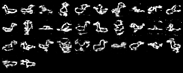

# Bird Drawing Guesser
by Nathan Nguyen\
for CSE 455 Spring '22

## Summary
Bird Drawing Guesser (BDG) was inspired by the recent influx of "Wordle" type games. In BDG, the player guesses the type of bird that a drawing is supposed to represent. If they guess incorrectly, they are shown a more complex/detailed drawing.

## Data
I used Google's [Quick, Draw!](https://quickdraw.withgoogle.com/data) dataset. Originally, I began to work with their binary files. These provided 256x256 images with data describing each stroke in the drawing. Because of the difficulty in working with the stroke data and larger images, I decided to switch to using their numpy bitmaps. These are 28x28 images with no additional information. You can still view/play the version of BDG using the binary files [here](https://github.com/nathnguy/drawing-guesser/tree/binary).

## Defining Complexity
I knew that I wanted more complex drawings to have more features in them. Also, I thought about complex images having complicated shapes and patterns. This led me to using Harris Corner Detection in order to count the number of corners in a drawing. While I thought about using pixel density to define complexity, this would ignore non-informative drawings such as a black square. Having the number of corners for each drawing, I set boundaries and divided them into 3 complexity levels. In setting the boundaries for the number of corners in each complexity level, I wanted level 2 have the most drawings so it would represent the general drawing. This worked fairly well for getting levels 1 and 3 to represent the more extreme ends of the complexity spectrum.

Swans with increasing complexity from left to right:

  
   
  

The corners are labeled by red circles.  

As I will elaborate more on in the next section, I trained a Generative Adversarial Network with each bird drawing category. My original plan was to use the trained discriminator to define complexity in terms of which drawings the discriminator thought were most real. However, this didn't align with my original definition of complexity since some of the more detailed and more clear drawings were given low scores by the discriminator. Thus, I decided to keep defining complexity by the number of corners.

## Adding GANs
Inspired by a project for [drawing 10000 electric sheep](https://medium.com/libreai/dreaming-of-electric-sheep-d1aca32545dc), I thought that it would be cool to include a final level drawn by a Generative Adversarial Network. This project definitely showed me the difficulties in training a GAN. The discriminator overfitting and becoming too strong was a common issue. I learned about techniques to remedy this like adding noise, adjusting the learning rate/batch size, and normalizing the data.  

Here you can see what the generator produces at various points in the training process for duck drawings:

  
   
  
  

From left to right, the images are at iteration: 1, 7, 105, and 300.  

## Features for the Future

### Performance
The main issue in trying to produce the best results was that training the GAN took a significant amount of time (around 30-40 minutes per category). This made it difficult to test different learning rates, batch sizes, and training data size. I found that using 32,000 training samples produced slightly better results than 16,000 samples, but I ended up using the smaller input size to minimize training time. Thus, to improve the training speed I would configure my system to utilize the GPU. One more thing that I want to try is to improve the neural network architecture. I used a pretty simple feedforward neural network for both the generator and discriminator in order to make sure I could produce some sort of reasonable output, but using Deep Convolutional GAN techniques could improve the clarity of the drawings. Things like batch normalization, more complex layers, and noise injection could all help my GAN model.

### Complexity Categorization
I think that there is a lot of exploration that could still be done regarding the sorting of drawings into various complexity levels. The *Quick, Draw!* dataset was not completely clean in that some drawings had no relation to the category or that there were extraneous elements such as the category name being written on the drawing. A potential solution could be to use the discriminator to filter irrelevant data, and then use a technique such as Harris corner detection to establish complexity.

## Resources
- [Python graphics library by John Zelle](https://mcsp.wartburg.edu/zelle/python/graphics/graphics.pdf)\
I used this graphics library to render a window and draw images onto it.

- [Harris Corner Detection](https://muthu.co/harris-corner-detector-implementation-in-python/)\
This provided a way for me to check if a pixel represented a corner. I made slight modifications to return the number of corners and their locations.

- [MNIST GAN Implementation](https://www.kaggle.com/code/kmldas/mnist-generative-adverserial-networks-in-pytorch/notebook)\
My GAN was adapted from this GAN to generate images from the MNIST dataset. I mostly kept their neural network architectures, but I added my own code to normalize the *Quick, Draw!* data and make sure that it had the appropriate shape. Then, I saved and loaded the trained model to generate drawings for the BDG game.

- All gameplay logic is my own.

## Dependencies
- [Matplotlib](https://matplotlib.org/)
- [NumPy](https://numpy.org/)
- [PyTorch](https://pytorch.org/)
- [SciPy](https://scipy.org/)
- [Torchvision](https://pytorch.org/vision/)